# Deep Reinforcement Learning for Industrial Job-Shop Scheduling

[](https://www.python.org/)
[](https://pytorch.org/)
[](https://stable-baselines3.readthedocs.io/)
[](https://gymnasium.farama.org/)
[](https://numpy.org/)
[](https://pandas.pydata.org/)
[](#)
[](#)
[](./LICENSE)
[](./.github/workflows)

Production-oriented research codebase for **dynamic industrial job-shop scheduling** with deep reinforcement learning. The system models a factory floor with machines, tray capacities, recipe compatibility constraints, and continuously arriving jobs, then trains policies that make **direct job–machine assignment decisions** to minimize tardiness.

> **Research write-up:** [URN: urn:nbn:se:uu:diva-538891](http://urn.kb.se/resolve?urn=urn:nbn:se:uu:diva-538891)

<p align="center">
  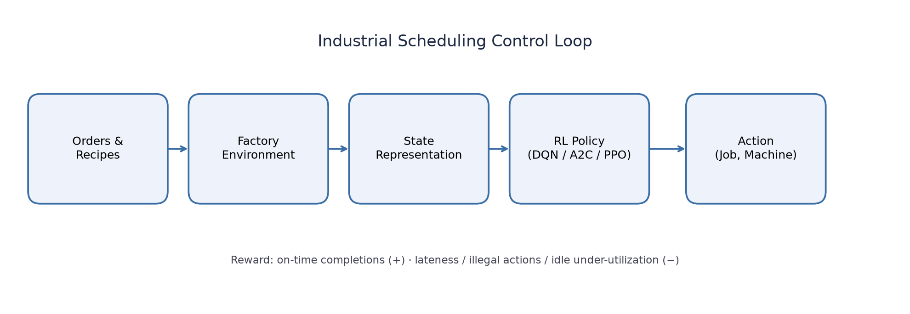
</p>

---

## Executive Summary

Manufacturing plants continuously receive production orders that must be sequenced across specialized machines under hard constraints: recipe compatibility, tray capacity, process duration, and due dates. Classical dispatch rules (FIFO, EDD, handcrafted heuristics) are fast but myopic—they optimize local criteria and struggle when machine capabilities overlap and job mix shifts over time.

This repository implements a **Gymnasium** simulation of that decision process and trains **Deep Q-Network (DQN)**, **Advantage Actor-Critic (A2C)**, and **Proximal Policy Optimization (PPO)** agents with **Stable-Baselines3** / **PyTorch**. Instead of selecting a dispatch rule, the agent chooses an explicit `(job, machine)` pairing (or No-Op / start-machine action) from a structured observation of queues, capacities, deadlines, and machine state.

**Business impact targeted by the control objective**

- Fewer late jobs (lower mean tardiness)
- Higher effective throughput under capacity constraints
- Better utilization of specialized vs multi-purpose machines
- A trainable policy that adapts as job mix and load change

In the primary evaluation configuration (**2 machines · 2 recipes · buffer size 3 · 1000 episodes**), a trained DQN policy reduces late-job rate to **~0.022%** versus **~0.13%** for EDD and **~0.51%** for FIFO on the same evaluation artifacts.

---

## Project Highlights

| Capability | Implementation |
|---|---|
| Custom industrial MDP | `custom_environment/` Gymnasium `FactoryEnv` |
| Direct job–machine actions | Discrete action space over buffer × machines + No-Op + start-machine |
| Constrained factory physics | Tray capacity, recipe eligibility, asynchronous completions |
| Learning stack | SB3 `MultiInputPolicy` for DQN / A2C / PPO |
| Strong baselines | Random, FIFO, EDD, process-time/deadline heuristic |
| Experiment ops | Training callbacks, pickled eval caches, comparative plotting |
| Docs & demos | Architecture diagrams, regenerated charts, scheduling GIFs |

<p align="center">
  
</p>

<p align="center"><em>Episode playback: machine tray utilization (left) and pending-job urgency (right).</em></p>

---

## Why Reinforcement Learning?

Job-shop scheduling is an NP-hard combinatorial optimization problem. In industrial settings it is also **dynamic**: new jobs arrive online, machines become free asynchronously, and feasible assignments depend on evolving capacity and recipe locks.

| Classical approach | Limitation in this setting |
|---|---|
| Exact MIP / CP solvers | Hard to re-solve at every event under tight latency |
| Metaheuristics (GA, ACO, PSO) | Expensive to warm-start continuously |
| Dispatch rules | Fast, but local and brittle under multi-skill machines |

RL is a natural fit because:

1. The plant can be cast as an MDP with delayed rewards (completions happen after assignment).
2. Policies can be trained offline in simulation and executed with millisecond inference.
3. Direct action parameterization removes the need to hand-select a dispatch rule family.
4. Value-based methods (DQN) handle discrete constrained action sets well when exploration is managed carefully.

---

## System Architecture

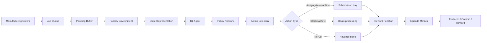

### Training Pipeline

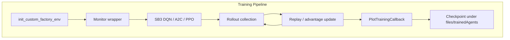

### Inference Pipeline

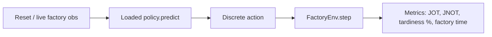

### Environment Data Flow

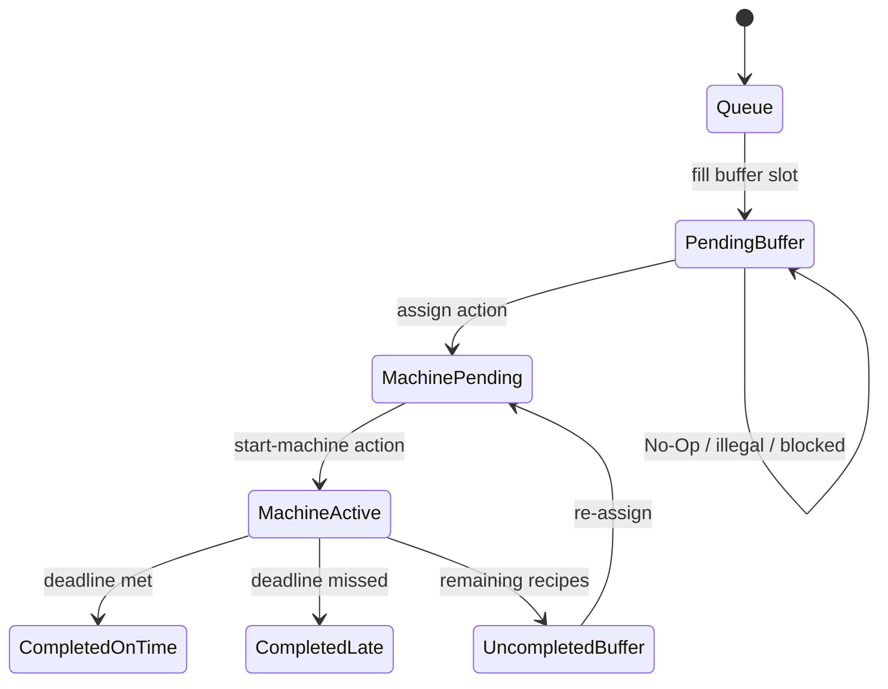

---

## Environment Design

Implemented in [`custom_environment/environment.py`](custom_environment/environment.py) as a Gymnasium `Env`.

### Decision process

At each decision point the agent may:

1. **Assign** a pending (or uncompleted-buffer) job to an available machine, if recipe + tray constraints allow
2. **Start** a machine that already has scheduled jobs
3. **No-Op**, advancing simulated factory time to the next meaningful event

### Observation space (`spaces.Dict`)

Normalized / encoded features include:

| Feature group | Signal |
|---|---|
| `new_jobs_queue` | Upcoming recipe mix in the arrival queue |
| `new_jobs_tray_capacities` | Tray demand foresight |
| `pending_job_recipe` | Recipes currently actionable in the buffer |
| `pending_job_tray_capacities` | Capacity required per pending job |
| `pending_job_process_time_deadline_ratio` | Urgency proxy |
| `pending_job_steps_to_deadline` | Time-to-due normalized |
| `machine_pending_capacity` / `machine_active_capacity` | Utilization |
| `machine_active_recipe` / `machine_recipes` | Compatibility & current lock-in |
| `machine_is_available` | Binary availability |

### Action space

\[
|\mathcal{A}| = |\mathcal{M}| \cdot B + 1 + |\mathcal{M}|
\]

(+ optional uncompleted-buffer assignment branch in expanded settings)

where \(B\) is buffer size and \(+1\) is No-Op.

### Reward shaping

Dense step rewards encourage feasible scheduling and discourage myopic / illegal behavior:

| Event | Typical weight |
|---|---:|
| Job completed on time | `+10` |
| Job completed late | `-15` |
| Valid assignment | `+1` to `+5` |
| Deadline pressure / idle misuse | `-5` … `-20` |
| Invalid recipe / unavailable machine | `-20` … `-30` |
| Illegal action | `-15` |

Rewards were iteratively refined against training curves (see research write-up, Section 3.6.3 / 4.x).

### Episode lifecycle & termination

- Episodes run up to `max_steps` (commonly 4k–10k for eval, larger for train).
- During training, catastrophic cumulative reward can trigger early termination (`is_evaluation=False`).
- Factory clock advances either by 1 tick, by No-Op jump, or to the soonest machine completion.

### Industrial constraints encoded

- Recipe eligibility per machine (specialized vs multi-purpose)
- Tray capacity packing before process start
- Stochastic / distributional recipe arrivals inspired by plant recipe frequencies
- Optional refresh of arrival time when jobs enter the buffer (`refresh_arrival_time`)

---

## Model Architecture

### Algorithms implemented

| Algorithm | Role in this repo | Notes |
|---|---|---|
| **DQN** | Primary learner | Value-based, `MultiInputPolicy`, strongest empirical results |
| **A2C** | Actor–critic baseline | Often under-learned in this sparse/delayed-reward MDP |
| **PPO** | On-policy baseline | Used in comparative runs; batch size tuned to 2048 |

### Policy network

SB3 `MultiInputPolicy` flattens the Dict observation and feeds an MLP:

- Default DQN net: `[64, 64]` ReLU
- Stronger DQN configs: `[128, 128, 64]`
- Discount \(\gamma\) typically `0.6–0.99` (higher \(\gamma\) for long-horizon tardiness)

### Experience & optimization (DQN)

1. ε-greedy exploration with configurable `exploration_fraction`
2. Replay buffer (e.g. 20k transitions), minibatch SGD on Bellman residual
3. Target network soft/hard updates via SB3 defaults
4. Periodic evaluation + `PlotTrainingCallback` for reward/tardiness curves

### Training loop (conceptual)

```text
for t in 1..T:
  a_t ~ π_θ(s_t)            # or ε-greedy for DQN
  s_{t+1}, r_t, done = env.step(a_t)
  store / update
  if callback_interval: plot + checkpoint
```

<p align="center">
  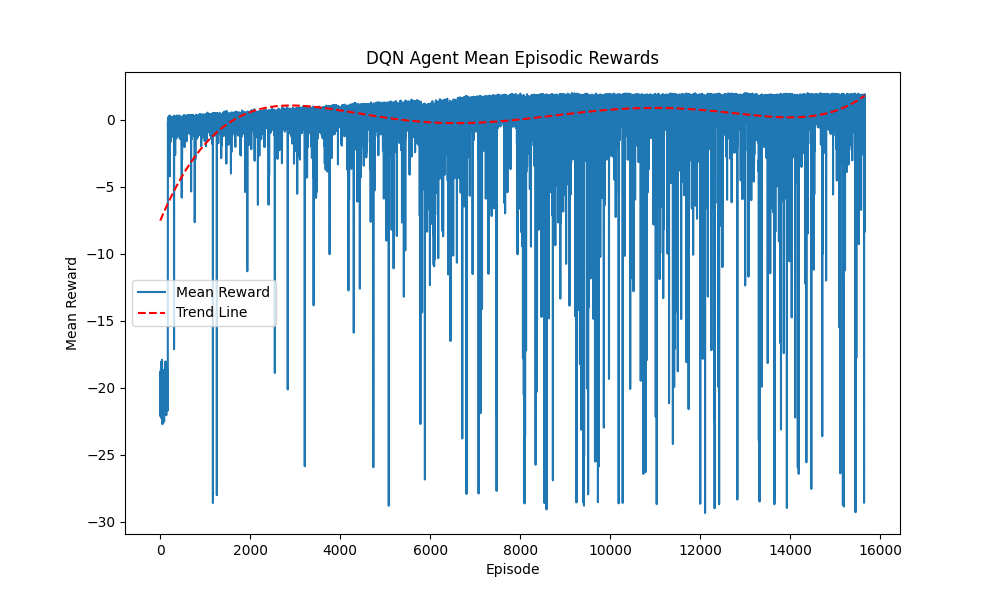
</p>

<p align="center">
  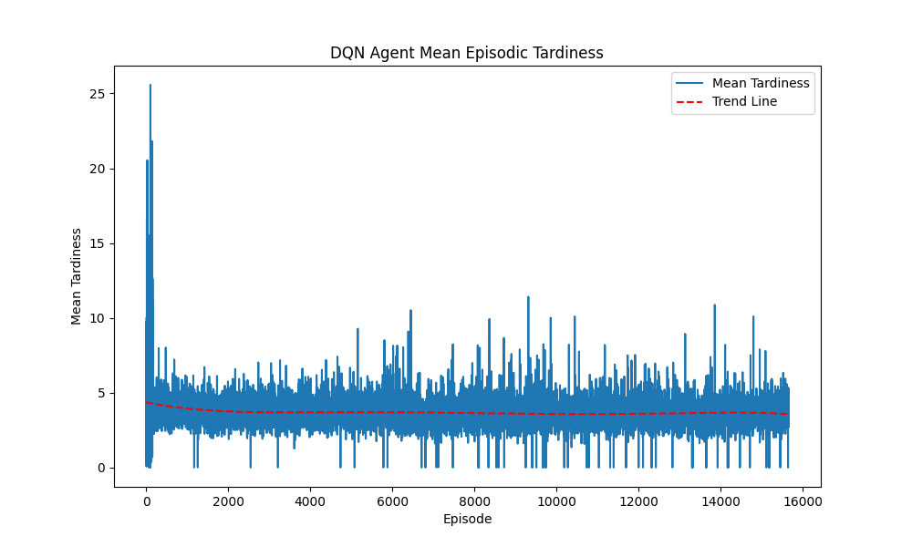
</p>

---

## Experimental Methodology

### Factory configurations

| Config | Machines | Recipes | Buffer | Purpose |
|---|---:|---:|---:|---|
| Simple specialized | 2 | 2 | 3 | Primary learning / baseline comparison |
| All-purpose machines | 2 | 2 | 3 | Stress multi-skill contention |
| Expanded observation | 2–4 | 2–3 | 2–3 | Queue + availability + recipe features |
| Larger plant slices | up to 10 | up to 14 | 3–10 | Scalability probes using plant recipe frequencies |

Recipe durations / frequencies are instantiated from industrial recipe metadata in `environment_factory.py`.

### Baselines

- **Random** — uniform illegal-prone exploration reference
- **FIFO** — oldest pending job first
- **EDD** — earliest due date first
- **Heuristic (HDR)** — prioritize high process-time/deadline ratio + capacity-aware starts

### Evaluation protocol

- Deterministic policy rollout (`predict(..., deterministic=True)`)
- Typically **1000 episodes**
- Metrics logged per episode: cumulative reward, tardiness %, jobs on time (JOT), jobs late (JNOT)
- Results cached as pickles under `files/data/` for reproducible plotting (`compare_agents.py`)

---

## Results

> Figures below are regenerated from checked-in evaluation pickles via `scripts/generate_docs_assets.py`. No metrics were fabricated.

### Primary benchmark (2m · 2r · buffer 3 · 1000 episodes)

| Agent | Mean Reward | On-time Jobs | Late Jobs | Total Jobs | Late Rate |
|---|---:|---:|---:|---:|---:|
| **DQN** | **5399.24** | 7482.74 | **1.66** | 7484.40 | **0.022%** |
| EDD | 1535.87 | **8057.14** | 10.39 | **8067.53** | 0.128% |
| FIFO | -52786.61 | 6907.89 | 35.45 | 6943.34 | 0.512% |
| Heuristic | -17636.01 | 4881.07 | 306.06 | 5187.13 | 5.902% |
| A2C | -192262.79 | 1865.43 | 128.88 | 1994.31 | 6.521% |

**Takeaway:** DQN achieves the best tardiness and reward. EDD completes slightly more total jobs but with ~6× higher late rate than DQN in this configuration. A2C fails to match value-based learning here.

<p align="center">
  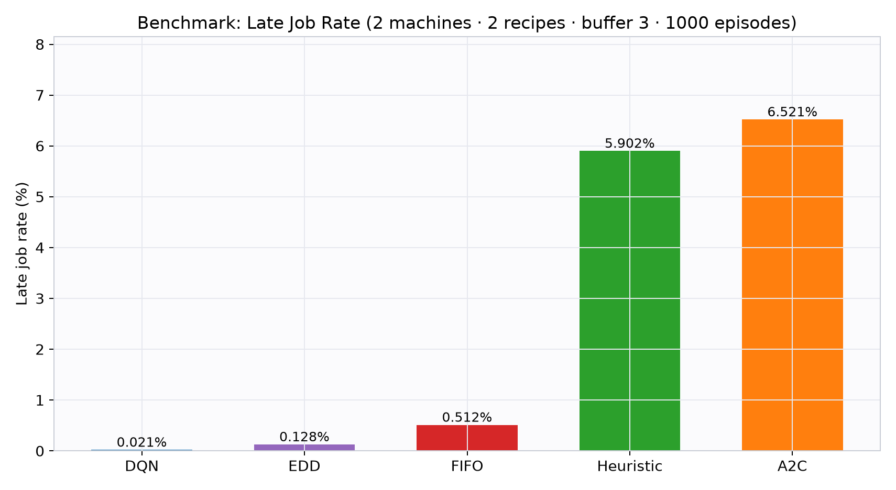
</p>

<p align="center">
  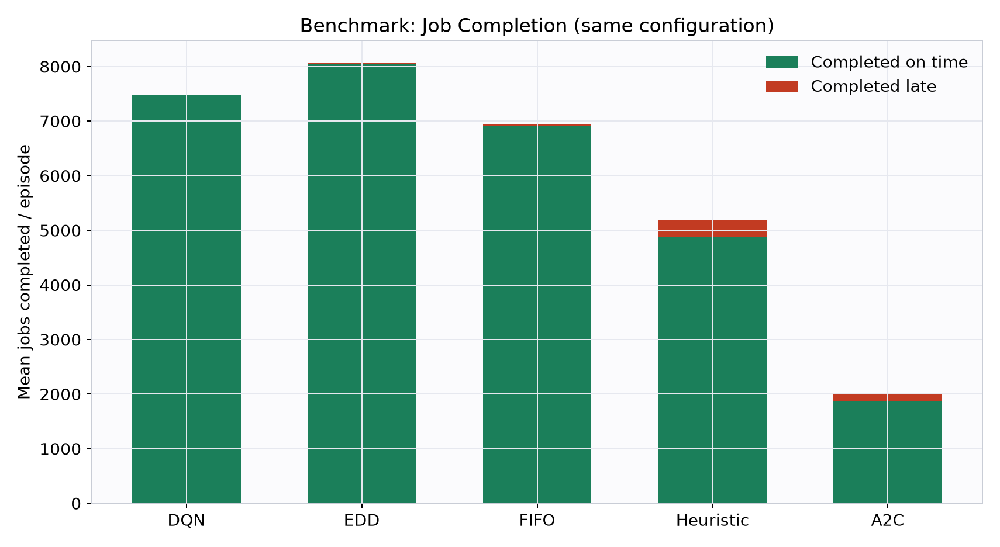
</p>

<p align="center">
  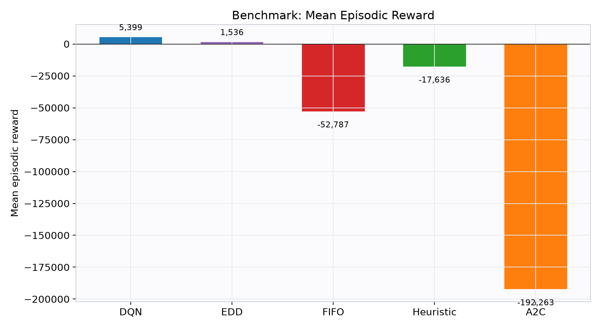
</p>

### All-purpose machines (throughput vs tardiness)

When machines can run multiple recipes, myopic dispatch rules under-utilize packing opportunities. RL agents complete substantially more jobs, at the cost of higher late rates—an explicit throughput/tardiness trade-off observed in the research experiments:

| Agent | On-time | Late | Total | Late Rate |
|---|---:|---:|---:|---:|
| A2C | 6161.45 | 758.70 | **6920.15** | 11.83% |
| DQN | 5164.75 | 707.05 | 5871.80 | 12.32% |
| EDD | 3011.23 | 165.65 | 3176.88 | **5.35%** |
| Heuristic | 2273.17 | 175.22 | 2448.39 | 7.25% |
| FIFO | 1396.20 | 148.42 | 1544.62 | 9.67% |

<p align="center">
  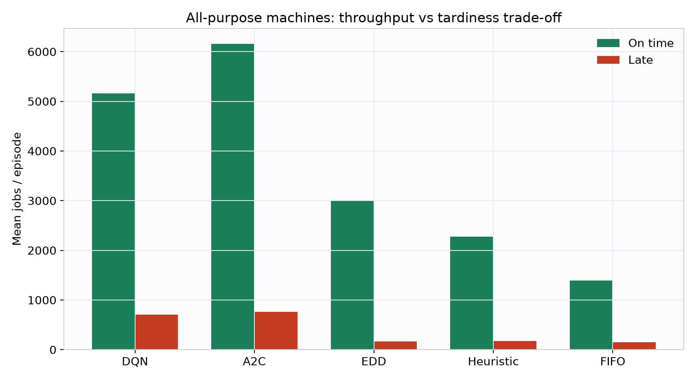
</p>

### Feature / arrival-time ablation highlight

With refreshed arrival-time semantics and a trained DQN (`20M` steps, RAT setting), late rate drops to **~0.05%** while sustaining high on-time throughput—evidence that observation design materially affects policy quality.

<p align="center">
  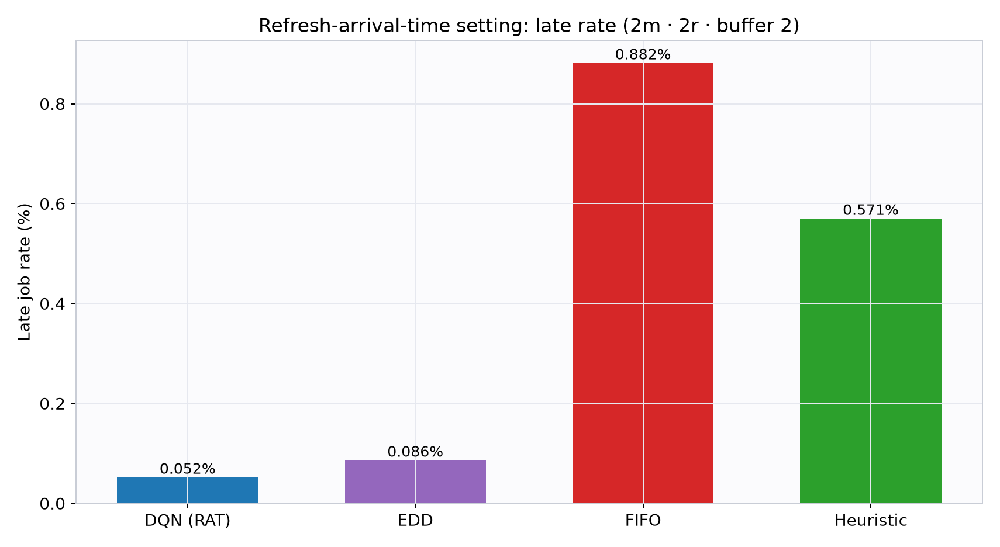
</p>

### Qualitative scheduling demos

| Heuristic policy | Random policy |
|---|---|
|  | 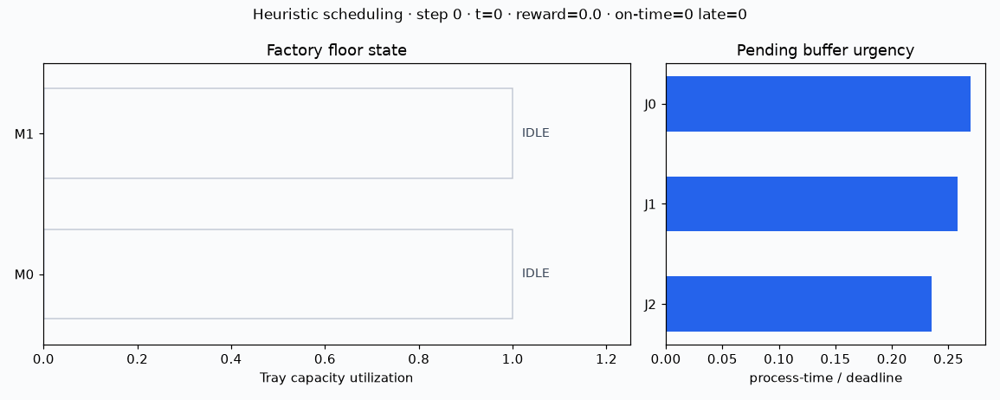 |

---

## Project Structure

```text
.
├── custom_environment/          # Gymnasium factory MDP + domain models
│   ├── environment.py           # FactoryEnv: obs/action/reward/step dynamics
│   ├── environment_factory.py   # Scenario builders (recipes, machines, jobs)
│   ├── job.py / machine.py / recipe.py
│   ├── *_factory.py             # Object construction helpers
│   └── utils.py                 # Normalization, IO helpers, pretty printers
├── callback/
│   └── plot_training_callback.py
├── scripts/
│   └── generate_docs_assets.py  # Regenerate docs charts + GIFs
├── docs/
│   ├── images/                  # Benchmark & training figures
│   └── gifs/                    # Episode visualizations
├── files/
│   ├── data/                    # Cached evaluation pickles
│   ├── plots/                   # Historical training/eval plots
│   ├── trainedAgents/           # Saved SB3 policies
│   └── references/              # Related research PDFs
├── dqn_agent.py / a2c_agent.py / ppo_agent.py
├── fifo_agent.py / edd_agent.py / heuristic_agent.py / random_agent.py
├── compare_agents.py            # Head-to-head evaluation + plots
├── eval_dqn.py                  # Focused DQN evaluation entrypoint
├── manual_agent.py              # Interactive environment probing
├── tests/                       # Smoke tests for environment contracts
├── requirements.txt
├── Dockerfile
└── README.md
```

---

## How It Works

1. **Data / scenario loading** — `init_custom_factory_env(...)` samples recipes from industrial frequency weights and builds machines with valid recipe sets.
2. **Environment creation** — returns a Gymnasium-compatible `FactoryEnv` with Dict observations.
3. **Training** — SB3 agent collects rollouts, optimizes policy/value parameters, checkpoints models, and emits learning curves via callback.
4. **Evaluation** — frozen policy rolls out for \(N\) episodes; metrics persisted to `files/data/*.pkl`.
5. **Visualization** — `compare_agents.py` and `scripts/generate_docs_assets.py` produce comparative charts and GIFs.
6. **Prediction / inference** — `model.predict(obs, deterministic=True)` maps live observations to scheduling actions.

---

## Tech Stack

| Layer | Technology | Why |
|---|---|---|
| Language | Python 3.10+ | Research + production ML standard |
| DL | PyTorch 2.1 | Backend for SB3 policies |
| RL | Stable-Baselines3 2.2 | Battle-tested DQN/A2C/PPO |
| Env API | Gymnasium 0.29 | Standard MDP interface / SB3 compatibility |
| Numerics | NumPy / Pandas | Observation transforms & analysis |
| Viz | Matplotlib / Plotly / Pillow | Training curves, benchmarks, GIFs |
| Quality | Black / Ruff / GitHub Actions | Formatting, lint, env validation |
| Packaging | Docker | Reproducible runtime |

---

## Installation

```bash
git clone <repo-url>
cd <repo>
python -m venv .venv
source .venv/bin/activate   # Windows: .venv\Scripts\activate
pip install -r requirements.txt
```

### Docker

```bash
docker build -t industrial-drl-jss .
docker run --rm -it -v "$PWD":/app industrial-drl-jss bash
```

---

## Running the Project

### Smoke-check the environment

```bash
python -c "from stable_baselines3.common.env_checker import check_env; \
from custom_environment.environment_factory import init_custom_factory_env; \
check_env(init_custom_factory_env())"
```

### Manual / interactive probing

```bash
python manual_agent.py
```

### Train

```bash
# DQN (primary)
python dqn_agent.py

# A2C / PPO
python a2c_agent.py
python ppo_agent.py
```

Training hyperparameters (steps, γ, network width, machine/recipe counts) are defined in each agent’s `__main__` block. Checkpoints land in `files/trainedAgents/`.

### Evaluate a trained DQN

```bash
python eval_dqn.py
```

### Baseline + RL comparison

```bash
python compare_agents.py
```

Uses cached pickles when present; otherwise runs episodic evaluations and writes plots under `files/plots/`.

### Dispatch-rule baselines only

```bash
python fifo_agent.py
python edd_agent.py
python heuristic_agent.py
python random_agent.py
```

### Regenerate documentation assets

```bash
python scripts/generate_docs_assets.py
# or
python scripts/generate_docs_assets.py --figures-only
python scripts/generate_docs_assets.py --gifs-only
```

### Tests

```bash
python -m pytest -q
```

---

## Engineering Decisions

| Decision | Rationale | Tradeoff |
|---|---|---|
| **Gymnasium** | Standard interface; SB3/env_checker ecosystem | Custom rendering still needed for factory UX |
| **Stable-Baselines3** | Reliable DQN/A2C/PPO, Dict obs support via `MultiInputPolicy` | Less research flexibility than a from-scratch trainer |
| **DQN as primary algorithm** | Discrete constrained actions; strong empirical sample efficiency here | Sensitive to reward scale & exploration schedule |
| **Direct job–machine actions** | Avoids dispatch-rule indirection; learns packing + timing jointly | Action space grows with \(B \times M\) |
| **Dense shaped rewards** | Completions are delayed; shaping stabilizes early learning | Risk of proxy-objective mismatch vs pure tardiness |
| **Iterative obs expansion** | Feature ablations (queue, availability, tray caps) drove gains | Longer experiment cycles; config sprawl in filenames |
| **Pickle-cached eval** | Cheap replotting for 1000-episode studies | Must version filenames carefully per config |

### Scalability notes

- Observation/action sizes scale with machines and buffer length.
- Multi-million to hundreds-of-millions step runs were used for harder configs.
- Larger plants likely need action masking, hierarchical policies, or graph encoders.

---

## Limitations

1. **Reward design** — shaped rewards accelerate learning but can drift from pure business KPIs; some training phases show reward regressions.
2. **Observation completeness** — residual information gaps remain for long-horizon contention.
3. **Generalization** — policies are configuration-sensitive (machine map, recipe mix, arrival semantics).
4. **Compute** — competitive DQN runs often require \(10^7\)–\(10^8+\) environment steps.
5. **Deployment gap** — bridging simulation assumptions to live MES/APS integration (latency, uncertainty, human overrides) is future work.
6. **A2C/PPO** — on-policy methods underperformed DQN on several setups in this MDP.

---

## Future Work

- **Transformer / sequence policies** for queue-aware attention over jobs
- **Graph Neural Networks** over job–machine bipartite graphs
- **Multi-agent RL** (machine-local actors + global critic)
- **Curriculum learning** from small plants → full recipe catalogs
- **Action masking** for illegal assignments (cleaner exploration)
- **Distributed training** with Ray RLlib / large-scale rollout workers
- **Experiment tracking** with Weights & Biases or MLflow
- **Cloud deployment** of inference microservices beside factory digital twins
- **Safer reward learning** / constrained RL for hard service-level objectives

---

## Research Contributions

1. **Direct assignment MDP** for industrial batch/job-shop scheduling with tray capacities and recipe constraints—not merely dispatch-rule selection.
2. **Iterative environment/obs/reward engineering methodology** showing which features (especially machine availability) unlock stable DQN learning.
3. **Systematic comparison** of DQN vs A2C vs PPO vs FIFO/EDD/HDR across specialized and multi-purpose machine regimes.
4. **Evidence** that value-based DRL can beat strong due-date heuristics on tardiness in the primary configuration, while exposing throughput–tardiness trade-offs in all-purpose settings.
5. **Reproducible research engineering artifacts**: factories, callbacks, cached evaluations, and regeneration scripts for figures/GIFs.

---

## Production Considerations

If productizing this stack beside a real plant:

| Concern | Recommendation |
|---|---|
| Safety | Shadow-mode inference before closed-loop control |
| Constraints | Hard action masks + fallback to EDD on OOD states |
| Latency | Amb-frozen MLP policy; batch obs serialization |
| Drift | Continual evaluation against live KPI dashboards |
| Auditability | Log `(state, action, expected Q, realized tardiness)` |
| Integration | Adapter layer from MES events → Gymnasium-like obs |
| Rollback | Keep dispatch-rule baseline as hot standby |

---

## Roadmap for Recruiters & Contributors

Additional repository upgrades that further strengthen production readiness (several already started in-tree):

- [x] Professional architecture documentation & Mermaid diagrams
- [x] Regenerated benchmark charts from real eval artifacts
- [x] Lightweight scheduling GIFs (no core-algo changes)
- [x] Dockerized runtime
- [x] Environment smoke tests + CI hooks
- [ ] Interactive Streamlit/Gradio demo for episode playback
- [ ] Action masking wrapper + illegal-action analytics
- [ ] W&B/MLflow experiment templates
- [ ] Deterministic seed harness + benchmark report CI job
- [ ] Semantic versioning / tagged releases of env + baselines
- [ ] Typed public API package layout (`src/`)

---

## Citation

If you use this repository, please cite the research write-up:

```bibtex
@mastersthesis{adjei2024drljss,
  title  = {Deep Reinforcement Learning for Industrial Job-Shop Scheduling},
  author = {Adjei, Derrick Nii Adjei},
  year   = {2024},
  school = {Uppsala University},
  url    = {http://urn.kb.se/resolve?urn=urn:nbn:se:uu:diva-538891}
}
```

---

## License

MIT License — see [LICENSE](./LICENSE).

---

## Skills Demonstrated

✔ Reinforcement Learning  
✔ Deep Learning  
✔ PyTorch  
✔ Stable-Baselines3 / Gymnasium  
✔ Production Python  
✔ Software Engineering  
✔ Discrete-Event Simulation  
✔ Combinatorial Optimization  
✔ Industrial AI / Manufacturing Decision Systems  
✔ Research Engineering  
✔ Experiment Design & Ablations  
✔ Data Analysis & Scientific Visualization  
✔ Benchmarking against operational heuristics  
✔ CI-friendly ML repository design  
